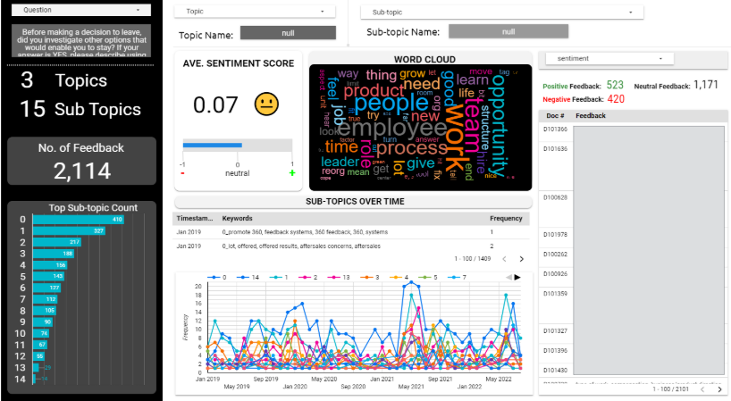

# 📁 HR Exit Feedback Surveys Topic Modeling

## 📝 Description
Built a topic modeling approach for exit surveys that allows us to reveal certain trends in topics or words
commonly associated with employees turnover and later categorize those employees based
on their feedback. This includes knowing the decision behind and can classify as
preventable or non-preventable departure.

## 🛠️ Tech Stack
- Python
- Bertopic
- HuggingFace
- Spacy Transformers
- Cohere
- Looker Studio (For Dashboard)

## 🚀 Key Contributions 
- By streamlining 9,000 responses equating to over 135,000 words, at least a total of **22** hrs are saved in manually reading all. This allows HR professionals to focus on interpreting the results rather than getting bogged down in the manual analysis.
- Design and build a dashboard on Looker Studio for HR people to monitor.

## 📸 Sample Dashboard

## 🧠 Skills Demonstrated
- Data Cleanup/Processing
- Natural Language Processing
- Sentiment Analysis
- Performance Evaluation
- Dashboard for Analytics
